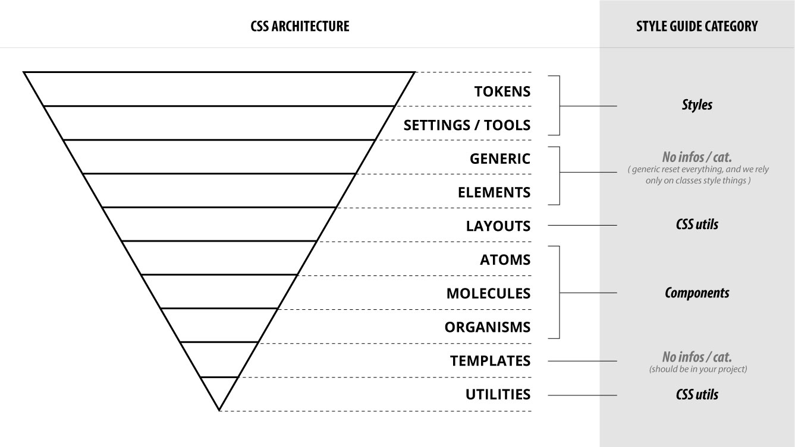

# Prefixes

You may have noticed that we are using prefixes from the previous code exemples.   
The prefix is composed of two letters and followed by a dash : `.pr-class-name`.

### The first letter is the _source identifier_ of the class :

For instance, we will use the letter `g` that stand for _**Garden**_, and tell us that the class come from the _**Garden design system**_. Another reason to use this source ID is that if anybody chose to use the same naming conventions that are described in this documentation, we need a differentiator.

_**This will make our two cohabiting code source collision proof.**_ 

### The second letter is our ATOMIC / ITCSS class type identifier :

lets' review our architecture : 



All the elements within the _**layout**_ to the _**utilities**_ layers will have class names. Each of witch will take the second letter as a **class type identifier** in the prefix :


So for instance, if you are creating a layout class for a drop down, you should call your block entity `.gl-drop-down`. You can read it _**"garden layout drop down".**_

### Others types of classes \(and prefixes\) :

There is also two other types of prefixes :

#### JS hooks :

The JS hooks are selectors that are used only by javascript in order to select elements.


**Those classes should not have any styles**, and be used only in the markup as a mean to select one or more elements. 


They can be **IDs or classes depending on wether or not you need to select one or multiple elements**. 

```markup
<button id="js-drawer-toggler">MENU</button>
```

_\*\*\*\*_

#### State classes :

State classes are classes that are generally **added via javascript**. It is important to **not mistake modifiers and states**. A modifier is a variation of an entity where **a state is a behavior that may change during the user's experience**. 


Note that state classes **should never be used alone**, but **always in association with their related entity**.



**State classes should use an Auxiliary verbs as prefix.**


Let's see some exemples of state classes used with their related entity. 

```css
.gm-list.is-empty {}
.go-search__results.has-none {}
.go-modal.is-open {}
.ga-button.is-disabled {}
.gm-carousel__auto-play.is-on {}
```


**Themes classes :**

Themes classes are used to create multiple themes. This is not very often that you should use theme and they are only meant to create aesthetic variations of your design like a _**dark mode**_. 


_**Do not use themes only has a mean to override the Garden library in your project.**_ 


We will see how it should be done later in.

To create themes you need to override your main theme using a theme classe. 

```css
.gt-dark-mode {

    .go-main-menu {
        background: $dark-bg;
        color: $light-text;

        &__item {
            border-color: $dark;
        }
    }
}
```


**Scope classes :**


**Scope classes are used for markups you don't have control over. \(only\)**


For exemple,  if you have a **WYSIWYG editor that output markup with classes that you don't have control over**, use a Scope to style them : 

```css
.gs-wiziwig-output {
    h1, h2, h3 {
        margin-top: 2em;
        margin-bottom: 1.25em;
    }
    
    .title { /*...*/ }

    p { /*...*/ }    
}
```

Or a date-picker library : 

```css
.gs-date-picker {
    .bootstrap-datepicker {
        /* ... */
    }
}
```

### 

### Main advantages of the prefix system :

From this typing naming conventions, you can :

#### Understand the rules that apply to a class

```markup
<div class="go-main-menu is-open">...</div>
<!-- components and organisms rules apply here -->
<!-- state class rules apply here -->
```

**Know immediately where the classe is declared** 

```markup
<div class="go-main-menu">...</div>
<!-- garden library: styles/organisms/main-menu.scss -->
```

#### Know immediately where to find the docs in the style-guide

```markup
<div class="go-main-menu">...</div>
<!-- http://www.garden-design-system.io/components/organisms/main-menu -->
```

#### And the best part :

All theses conventions for the classes names can be parsed , that mean that **we will be able to build a custom linter tool that understand every types of classes, apply specific rules to them, and redirect you to the specific doc when warning you.** Awesome right ? 

_**Side note**_: Some time ago I started to develop a PostCSS / Stylelint library for that purpose. Maybe I will found enough time to finish it, and if any body want to help me, he is welcome :\)


**For more informations, you can and should definitely read** [**this awesome article**](https://csswizardry.com/2015/08/bemit-taking-the-bem-naming-convention-a-step-further/) **by Harry Roberts**



