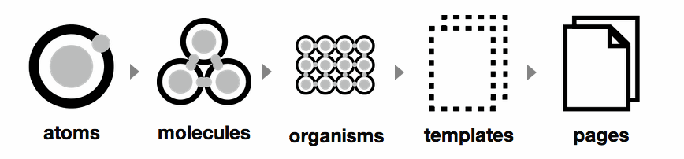

# Atomic Design System

### A shared language

Atomic design system **isn't a CSS architecture**. 


ADS is a convention to organize the interfaces design patterns in a **hierarchic** system.  
It uses the **Atoms** / **Molecules** / **Organisms** allegory.


The goal is to share a language between designers, developers, stakeholders regardless of there technical background \(technical teams, creative teams, stakeholders ...etc\). **ADS** was introduced by _**Brad Frost**_

### A bottom up approach

**ADS** invite us to create the more global, smalls, atomics parts first and using them as building blocks for higher-level entities, and repeating the process to produce pages.

We will se later how we integrate ADS to our CSS architecture, and even **slightly deviate from the original definition.** 


**More informations about Atomic design system :**   
[**a great article**](https://uxdesign.cc/atomic-design-how-to-design-systems-of-components-ab41f24f260e)  
****[**the original documentation**](http://atomicdesign.bradfrost.com)


