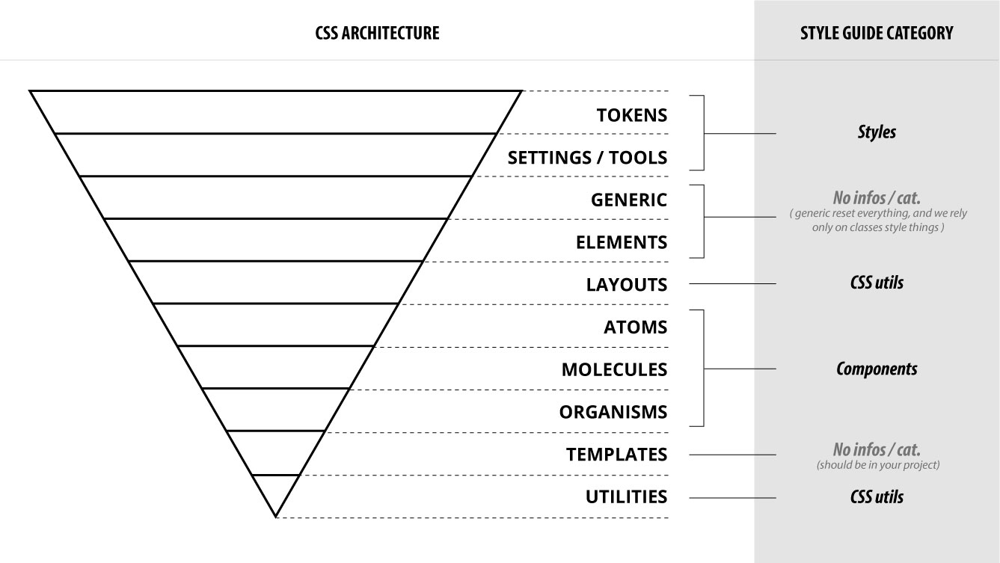

# Unifying ITCSS with ADS

You may have noticed that **ITCSS and Atomic Design System have two different ways of naming and organizing things**. In this part we will see how we can Use both in order to have at the same time the benefits of the common naming scheme of **ADS** and the stability and safety provided by the **ITCSS architecture**.

### The problem with Atomic Design System applied to CSS :

If we read the docs of atomic design system, we can see that a color is an atom. An input field is too.  
From the perspective of a CSS developper, this make no sense.

A color is a value given to a propertertie, like `color: blue;`. 

An input field is either represented by a type selector \(`input[type="text"] {...}`\) or by a class \(`.my-input { ... }`\)

Theses differences makes the naming scheme not suited to be applied to a css architecture. This is a problem because a design system should be a shared language, like a building guide for all, from designer to developpers, including product and marketing peoples.

#### So what should we do ? 

We will keep the Atoms, molecules and Organisms names only for components, and use the ITCSS naming scheme for variables. 

### What about ITCSS ?

#### Objects become Layouts : 

From experience, **Objects** in ITCSS are the most misunderstood parts of the pyramid. In my opinion, we should rename them **Layouts.** By layout, I don't mean pages layouts, but shunks of layouts utilities, or layout "components". Like the `.grid` from Boostrap.

let's remind us the definition of the **ITCSS object layer** :  __

> _"Cosmetic-free design patterns"._

for exemple, imagine that you want to create a drawer. It's a common design pattern for mobile device. When you click on a button, a panel slide from the hidden left or right part of your interface to show you \(generally\) the main navigation menu.

Let's imagine that you want to extract this behavior for multiple purposes.

You will create a **drawer object** \(or Layout\), and use your main navigation in another component. Now, your main navigation component is decoupled from your drawer **Layout**, and you can reuse your drawer to display, for exemple, a user profile component.

Another \(good\) reason why we rename objects =&gt; _**layouts**_, is because we have another classe type that start with a **o**, and we use those types to create **prefixes** for our classes.



#### So, if I have page layouts, how should I name them ?

Good question ;\) . Here, Atomic design system come to our rescue with the **Template**  layer.  
Use this name to name pages's layouts

#### Settings and tools :

ITCSS describe settings and tools as two separated layers. But in my experience, using SASS or any preprocessors, some variables may need the use of calculation, or color functions to be instantiated. For this purpose, we will merge settings and tools in one layer, and even create a file where all settings and tools will be made available as one import.   
  
Remember also that we will make the use of tokens to be available for every plateforms

### Summarize the new architecture :

