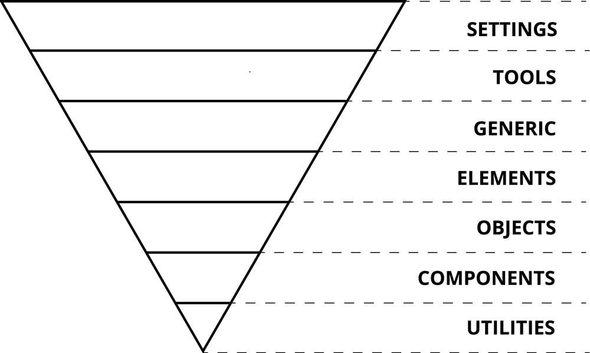
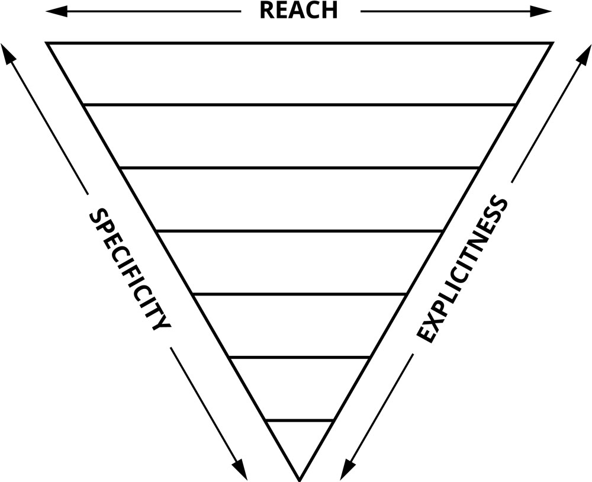

# ITCSS

## Inverted triangle architecture \(ITCSS\)

### What is ITCSS?

Inverted Triangle architecture for CSS.  
A sane, scalable, managed architecture.  
A school-of-thought, not a library.  
A meta framework; a framework for frameworks.  
**Incredibly simple.**

### The ITCSS architecture layers

1. **Settings**: Global variables, config switches.
2. **Tools**: Default mixins and functions.
3. **Generic**: Ground-zero styles \(Normalize.css, resets, box-sizing\).
4. **Base/Elements**: Unclassed HTML elements \(type selectors\).
5. **Objects**: Cosmetic-free design patterns.
6. **Components**: Designed components, chunks of UI.
7. **Utilities**: Helpers and overrides.

### The layers are organized following those metrics

* From the generic to the explicit.  
* From low specificity to high specificity. 
* From global reach to localized reach.


**I strongly recommend you to watch** [**the video presentation**](https://www.youtube.com/watch?v=1OKZOV-iLj4) **by Harry Roberts, and read this** [**good article**](https://www.xfive.co/blog/itcss-scalable-maintainable-css-architecture/) **about it. You also can read the** [**PDF version of the slides**](https://csswizardry.net/talks/2014/11/itcss-dafed.pdf) **used in his talk**


\*\*\*\*

